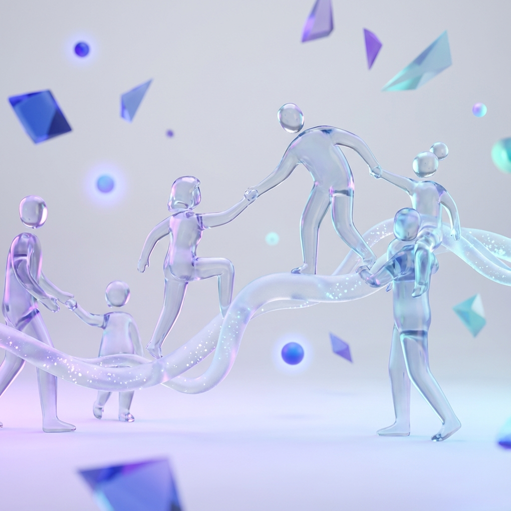
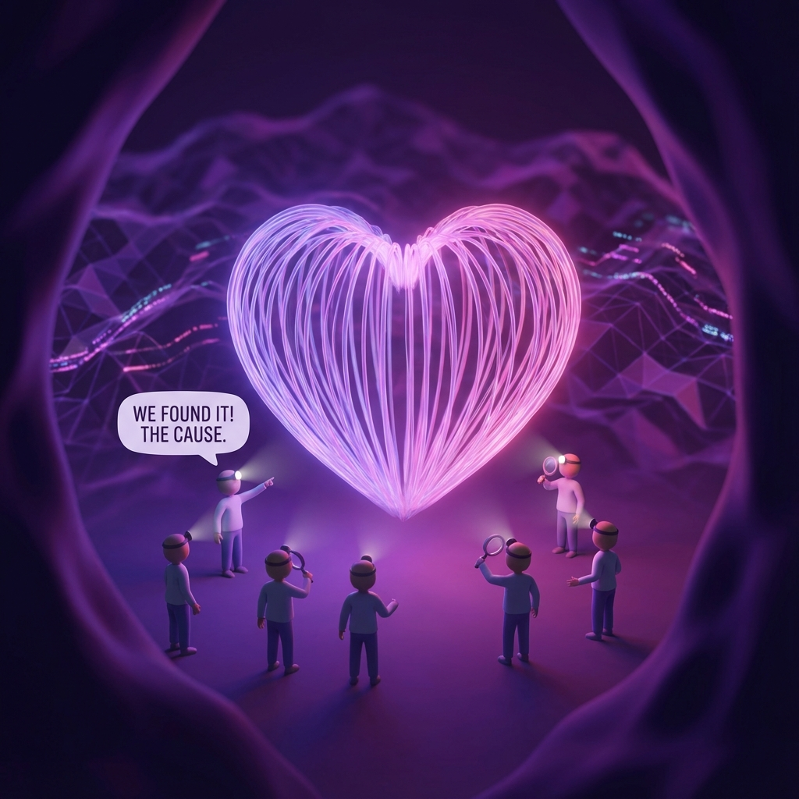
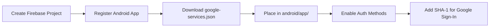
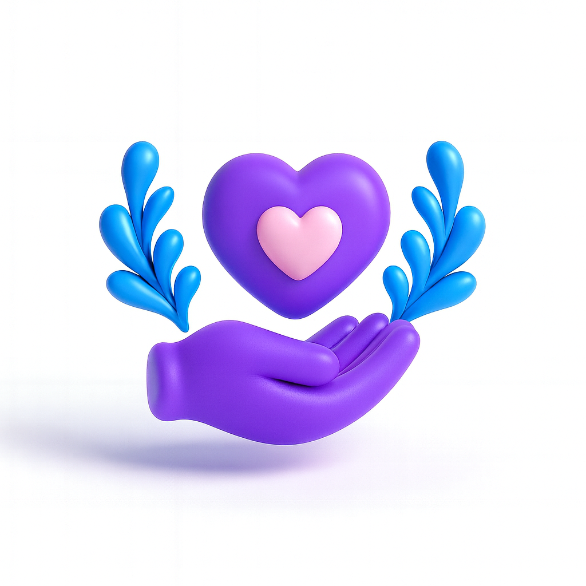

<div align="center">
<br>

<!-- HERO SECTION -->
<table>
<tr>
<td align="center" style="border:none;padding:0;">

</td>
</tr>
</table>

<br>

<h1 style="font-size:3.2em;margin:0;font-weight:800;background:linear-gradient(135deg,#8B5CF6,rgba(139,92,246,0.5),#3B82F6,#06B6D4);-webkit-background-clip:text;-webkit-text-fill-color:transparent;background-clip:text;letter-spacing:-1px;">HelpConnect</h1>

<p style="font-size:1.3em;color:#64748b;margin:4px 0;font-weight:500;">Uniting Hands, Transforming Lives</p>
<p style="font-size:1.05em;color:#94a3b8;margin:0 0 16px 0;">A Modern Cross-Platform Charity &amp; Donation Ecosystem</p>

<!-- ACTION BUTTONS -->
<a href="#-features"></a>&nbsp;
<a href="#-quick-start"></a>&nbsp;
<a href="#-architecture"></a>&nbsp;
<a href="#-donation-modules"></a>

<br><br>

<!-- BADGE ROW -->
<p>


</p>

<br>

<!-- DIVIDER -->
<svg width="60" height="4" viewBox="0 0 60 4" style="display:block;margin:0 auto;">
  <rect width="60" height="4" rx="2" fill="url(#g)" />
  <defs><linearGradient id="g" x1="0" y1="0" x2="1" y2="0"><stop offset="0%" stop-color="#8B5CF6"/><stop offset="50%" stop-color="#3B82F6"/><stop offset="100%" stop-color="#06B6D4"/></linearGradient></defs>
</svg>

</div>

<br>

---

<br>

## 📋 Table of Contents

<table>
<tr>
<td width="33%" valign="top">

- [🧭 Overview](#-overview)
- [📸 Screenshots](#-screenshots)
- [✨ Features](#-features)
- [🔐 Auth & Onboarding](#-auth--onboarding)
- [🏠 Home Dashboard](#-home-dashboard)
- [🎯 Donation Modules](#-donation-modules)

</td>
<td width="33%" valign="top">

- [📈 Campaigns & Fundraising](#-campaigns--fundraising)
- [🗺️ NGO Locator](#-ngo-locator)
- [📝 Request Wizard](#-request-wizard)
- [📜 Donation History](#-donation-history)
- [👤 Profile & Settings](#-profile--settings)
- [🔍 Smart Search](#-smart-search)

</td>
<td width="33%" valign="top">

- [🎨 Design System](#-design-system)
- [🛠️ Tech Stack](#-tech-stack)
- [📁 Architecture](#-architecture)
- [🚀 Quick Start](#-quick-start)
- [🧭 Navigation Map](#-navigation-map)
- [📊 Build Commands](#-build-commands)

</td>
</tr>
</table>

<br>

---

<br>

## 🧭 Overview

<div style="border-left:4px solid #8B5CF6;padding-left:20px;">

**HelpConnect** is a full-featured charity and donation mobile application that bridges the gap between donors and meaningful causes. Built from the ground up with **Flutter 3.9.2** and **GetX** state management, it delivers a premium, visually immersive experience for discovering, managing, and contributing to charitable initiatives across **11+ donation categories**.

The app features a stunning **glassmorphism** UI design, **animated 3D backgrounds**, complete **dark mode** support, **Firebase authentication**, and an intuitive navigation flow that guides users from onboarding through every aspect of giving — whether that's donating blood, clothes, medicine, food, or funding campaigns.

</div>

<br>

---

<br>

## 📸 Screenshots

<div align="center">

<!-- ONBOARDING + SPLASH ROW -->
<table>
<tr>
<th align="center" colspan="5" style="background:linear-gradient(135deg,#8B5CF6,#3B82F6);color:white;border-radius:8px 8px 0 0;padding:10px;">Onboarding &amp; Authentication Flow</th>
</tr>
<tr>
<td align="center" width="20%" style="border:0;padding:8px;">
<div style="border:3px solid #1E293B;border-radius:24px;padding:6px;background:#1E293B;box-shadow:0 8px 32px rgba(0,0,0,0.25);">

</div>
<sub><strong>Splash Screen</strong></sub><br><sub style="color:#94a3b8;">Animated Logo + Ripple</sub>
</td>
<td align="center" width="20%" style="border:0;padding:8px;">
<div style="border:3px solid #1E293B;border-radius:24px;padding:6px;background:#1E293B;box-shadow:0 8px 32px rgba(0,0,0,0.25);">

</div>
<sub><strong>Onboarding 1</strong></sub><br><sub style="color:#94a3b8;">Connect. Contribute. Change.</sub>
</td>
<td align="center" width="20%" style="border:0;padding:8px;">
<div style="border:3px solid #1E293B;border-radius:24px;padding:6px;background:#1E293B;box-shadow:0 8px 32px rgba(0,0,0,0.25);">

</div>
<sub><strong>Onboarding 2</strong></sub><br><sub style="color:#94a3b8;">Find Causes You Love</sub>
</td>
<td align="center" width="20%" style="border:0;padding:8px;">
<div style="border:3px solid #1E293B;border-radius:24px;padding:6px;background:#1E293B;box-shadow:0 8px 32px rgba(0,0,0,0.25);">

</div>
<sub><strong>Onboarding 3</strong></sub><br><sub style="color:#94a3b8;">Ready to Make a Difference?</sub>
</td>
<td align="center" width="20%" style="border:0;padding:8px;">
<div style="border:3px solid #1E293B;border-radius:24px;padding:6px;background:#1E293B;box-shadow:0 8px 32px rgba(0,0,0,0.25);">
<div style="background:linear-gradient(135deg,#8B5CF6,#3B82F6,#06B6D4);border-radius:18px;padding:40px 10px;min-height:120px;display:flex;flex-direction:column;align-items:center;justify-content:center;">
<span style="font-size:2.5em;">🔐</span>
<span style="color:white;font-weight:bold;font-size:0.9em;">Login / Signup</span>
<span style="color:rgba(255,255,255,0.7);font-size:0.75em;">Email + Google Auth</span>
</div>
</div>
<sub><strong>Authentication</strong></sub><br><sub style="color:#94a3b8;">Firebase Powered</sub>
</td>
</tr>
</table>

<br>

<!-- FEATURE SCREENS ROW 1 -->
<table>
<tr>
<th align="center" colspan="5" style="background:linear-gradient(135deg,#3B82F6,#06B6D4);color:white;border-radius:8px 8px 0 0;padding:10px;">Core App Screens</th>
</tr>
<tr>
<td align="center" width="20%" style="border:0;padding:8px;">
<div style="border:3px solid #1E293B;border-radius:24px;padding:6px;background:#1E293B;box-shadow:0 8px 32px rgba(0,0,0,0.25);">
<div style="background:linear-gradient(180deg,#0F172A,rgba(139,92,246,0.3));border-radius:18px;padding:28px 12px;min-height:130px;display:flex;flex-direction:column;align-items:center;justify-content:center;">
<span style="font-size:2.8em;">🏠</span>
<span style="color:white;font-weight:bold;margin-top:6px;">Home Dashboard</span>
<span style="color:rgba(255,255,255,0.6);font-size:0.7em;margin-top:2px;">Stats · Campaigns · Categories</span>
</div>
</div>
</td>
<td align="center" width="20%" style="border:0;padding:8px;">
<div style="border:3px solid #1E293B;border-radius:24px;padding:6px;background:#1E293B;box-shadow:0 8px 32px rgba(0,0,0,0.25);">
<div style="background:linear-gradient(180deg,#0F172A,rgba(239,68,68,0.3));border-radius:18px;padding:28px 12px;min-height:130px;display:flex;flex-direction:column;align-items:center;justify-content:center;">
<span style="font-size:2.8em;">🩸</span>
<span style="color:white;font-weight:bold;margin-top:6px;">Blood Donation</span>
<span style="color:rgba(255,255,255,0.6);font-size:0.7em;margin-top:2px;">Donate · Request Tabs</span>
</div>
</div>
</td>
<td align="center" width="20%" style="border:0;padding:8px;">
<div style="border:3px solid #1E293B;border-radius:24px;padding:6px;background:#1E293B;box-shadow:0 8px 32px rgba(0,0,0,0.25);">
<div style="background:linear-gradient(180deg,#0F172A,rgba(16,185,129,0.3));border-radius:18px;padding:28px 12px;min-height:130px;display:flex;flex-direction:column;align-items:center;justify-content:center;">
<span style="font-size:2.8em;">🍱</span>
<span style="color:white;font-weight:bold;margin-top:6px;">Food Donation</span>
<span style="color:rgba(255,255,255,0.6);font-size:0.7em;margin-top:2px;">Servings · Pickup</span>
</div>
</div>
</td>
<td align="center" width="20%" style="border:0;padding:8px;">
<div style="border:3px solid #1E293B;border-radius:24px;padding:6px;background:#1E293B;box-shadow:0 8px 32px rgba(0,0,0,0.25);">
<div style="background:linear-gradient(180deg,#0F172A,rgba(139,92,246,0.3));border-radius:18px;padding:28px 12px;min-height:130px;display:flex;flex-direction:column;align-items:center;justify-content:center;">
<span style="font-size:2.8em;">👕</span>
<span style="color:white;font-weight:bold;margin-top:6px;">Clothes Donation</span>
<span style="color:rgba(255,255,255,0.6);font-size:0.7em;margin-top:2px;">Category · Condition</span>
</div>
</div>
</td>
<td align="center" width="20%" style="border:0;padding:8px;">
<div style="border:3px solid #1E293B;border-radius:24px;padding:6px;background:#1E293B;box-shadow:0 8px 32px rgba(0,0,0,0.25);">
<div style="background:linear-gradient(180deg,#0F172A,rgba(245,158,11,0.3));border-radius:18px;padding:28px 12px;min-height:130px;display:flex;flex-direction:column;align-items:center;justify-content:center;">
<span style="font-size:2.8em;">💰</span>
<span style="color:white;font-weight:bold;margin-top:6px;">Money Donation</span>
<span style="color:rgba(255,255,255,0.6);font-size:0.7em;margin-top:2px;">Campaign Funding</span>
</div>
</div>
</td>
</tr>
</table>

<br>

<!-- FEATURE SCREENS ROW 2 -->
<table>
<tr>
<th align="center" colspan="5" style="background:linear-gradient(135deg,#EC4899,#FB923C);color:white;border-radius:8px 8px 0 0;padding:10px;">Advanced Features</th>
</tr>
<tr>
<td align="center" width="20%" style="border:0;padding:8px;">
<div style="border:3px solid #1E293B;border-radius:24px;padding:6px;background:#1E293B;box-shadow:0 8px 32px rgba(0,0,0,0.25);">
<div style="background:linear-gradient(180deg,#0F172A,rgba(99,102,241,0.3));border-radius:18px;padding:28px 12px;min-height:130px;display:flex;flex-direction:column;align-items:center;justify-content:center;">
<span style="font-size:2.8em;">🗺️</span>
<span style="color:white;font-weight:bold;margin-top:6px;">NGO Locator</span>
<span style="color:rgba(255,255,255,0.6);font-size:0.7em;margin-top:2px;">Map · Bottom Sheet</span>
</div>
</div>
</td>
<td align="center" width="20%" style="border:0;padding:8px;">
<div style="border:3px solid #1E293B;border-radius:24px;padding:6px;background:#1E293B;box-shadow:0 8px 32px rgba(0,0,0,0.25);">
<div style="background:linear-gradient(180deg,#0F172A,rgba(6,182,212,0.3));border-radius:18px;padding:28px 12px;min-height:130px;display:flex;flex-direction:column;align-items:center;justify-content:center;">
<span style="font-size:2.8em;">📈</span>
<span style="color:white;font-weight:bold;margin-top:6px;">Campaign Detail</span>
<span style="color:rgba(255,255,255,0.6);font-size:0.7em;margin-top:2px;">Story · Donors · Progress</span>
</div>
</div>
</td>
<td align="center" width="20%" style="border:0;padding:8px;">
<div style="border:3px solid #1E293B;border-radius:24px;padding:6px;background:#1E293B;box-shadow:0 8px 32px rgba(0,0,0,0.25);">
<div style="background:linear-gradient(180deg,#0F172A,rgba(236,72,153,0.3));border-radius:18px;padding:28px 12px;min-height:130px;display:flex;flex-direction:column;align-items:center;justify-content:center;">
<span style="font-size:2.8em;">📋</span>
<span style="color:white;font-weight:bold;margin-top:6px;">Donation History</span>
<span style="color:rgba(255,255,255,0.6);font-size:0.7em;margin-top:2px;">Timeline View</span>
</div>
</div>
</td>
<td align="center" width="20%" style="border:0;padding:8px;">
<div style="border:3px solid #1E293B;border-radius:24px;padding:6px;background:#1E293B;box-shadow:0 8px 32px rgba(0,0,0,0.25);">
<div style="background:linear-gradient(180deg,#0F172A,rgba(251,146,60,0.3));border-radius:18px;padding:28px 12px;min-height:130px;display:flex;flex-direction:column;align-items:center;justify-content:center;">
<span style="font-size:2.8em;">➕</span>
<span style="color:white;font-weight:bold;margin-top:6px;">Create Request</span>
<span style="color:rgba(255,255,255,0.6);font-size:0.7em;margin-top:2px;">3-Step Wizard</span>
</div>
</div>
</td>
<td align="center" width="20%" style="border:0;padding:8px;">
<div style="border:3px solid #1E293B;border-radius:24px;padding:6px;background:#1E293B;box-shadow:0 8px 32px rgba(0,0,0,0.25);">
<div style="background:linear-gradient(180deg,rgba(139,92,246,0.4),#0F172A);border-radius:18px;padding:28px 12px;min-height:130px;display:flex;flex-direction:column;align-items:center;justify-content:center;">
<span style="font-size:2.8em;">👤</span>
<span style="color:white;font-weight:bold;margin-top:6px;">Profile &amp; Settings</span>
<span style="color:rgba(255,255,255,0.6);font-size:0.7em;margin-top:2px;">Dark Mode · Edit Profile</span>
</div>
</div>
</td>
</tr>
</table>

</div>

<br>

---

<br>

## ✨ Features

### 🔐 Auth & Onboarding

<table>
<tr>
<th>Feature</th>
<th>Details</th>
</tr>
<tr>
<td><strong>Splash Screen</strong></td>
<td>Animated logo with ripple expansion, elastic scale-in (0→1 with Curves.elasticOut), and fade transitions — 3.5s flow before navigating</td>
</tr>
<tr>
<td><strong>Onboarding Flow</strong></td>
<td>3 auto-scrolling pages (3s interval) with <code>PageView</code>, smooth page indicator, skip button, and "Get Started" CTA on final page</td>
</tr>
<tr>
<td><strong>Login Screen</strong></td>
<td>Email/password with visibility toggle, "Forgot Password?" link, Google Sign-In with OAuth, glassmorphism card</td>
</tr>
<tr>
<td><strong>Signup Screen</strong></td>
<td>Full name, email, and password registration with form validation, animated transitions</td>
</tr>
<tr>
<td><strong>Firebase Auth</strong></td>
<td>Real authentication via <code>firebase_core</code> + <code>firebase_auth</code> + <code>google_sign_in</code> with reactive user stream</td>
</tr>
</table>

<br>

### 🏠 Home Dashboard

<div style="background:linear-gradient(135deg,#0F172A,rgba(139,92,246,0.15));border-radius:16px;padding:20px;border:1px solid rgba(139,92,246,0.2);">

| Component | Description |
|-----------|-------------|
| 📊 **Stats Cards** | Quick-glance metrics — Donations (12), People Impacted (35+), Volunteer Hours (48h) with glassmorphism cards |
| 🎠 **Featured Campaigns** | Infinite-loop auto-scrolling carousel with gradient overlays, progress bars, and <code>cached_network_image</code> |
| 📂 **Category Grid** | 11 categories in 2-column responsive grid with icon, color badge, and tap → screen navigation |
| 🔘 **Floating Action** | Center-aligned gradient FAB (Purple→Pink) with shadow glow for quick request creation |
| 🧭 **Bottom Navigation** | 4-tab glassmorphism bar with <code>BackdropFilter</code> blur, gradient icon tinting, and badge support |

</div>

<br>

### 🎯 Donation Modules

<table>
<thead>
<tr>
<th width="24">#</th>
<th>Module</th>
<th width="160">Icon</th>
<th>Key Capabilities</th>
</tr>
</thead>
<tbody>
<tr>
<td>01</td>
<td><strong>🩸 Blood</strong></td>
<td><code>Icons.water_drop</code></td>
<td>Dual-tab (Donate/Request), blood-type filter chips (A+/O-/B+/AB+), urgency badges (Critical/Normal), donor availability switch, contact dialog, form validation</td>
</tr>
<tr>
<td>02</td>
<td><strong>💊 Medicine</strong></td>
<td><code>Icons.medical_services</code></td>
<td>Medicine name input, quantity ± counter, expiry date picker, multi-photo upload (max 5), dashed upload border with "How to Donate" info card</td>
</tr>
<tr>
<td>03</td>
<td><strong>👕 Clothes</strong></td>
<td><code>Icons.checkroom</code></td>
<td>Category chips (Men's/Women's/Children's/Shoes) with icon grid, multi-photo upload, description, quantity, condition dropdown (Good/Very Good/Excellent/New), pickup address</td>
</tr>
<tr>
<td>04</td>
<td><strong>🍱 Food</strong></td>
<td><code>Icons.restaurant</code></td>
<td>Photo upload with Purple-Pink gradient header, food name + description fields, servings quantity ±, pickup address + available-until time fields</td>
</tr>
<tr>
<td>05</td>
<td><strong>💰 Money</strong></td>
<td><code>Icons.volunteer_activism</code></td>
<td>Category filter chips (All/Urgent/Education/Environment), campaign cards with gradient backgrounds, progress bars, raised vs goal amounts, days left counter, "Donate Now" action</td>
</tr>
<tr>
<td>06</td>
<td><strong>📚 Education</strong></td>
<td><code>Icons.school</code></td>
<td>Photo upload, item name + description fields, quantity ±, gradient purple-pink header, "Donate Supplies" action</td>
</tr>
<tr>
<td>07</td>
<td><strong>💻 Electronics</strong></td>
<td><code>Icons.devices_other</code></td>
<td>Photo upload, device details + condition description, quantity ±, teal gradient theme, "Bridging the digital divide"</td>
</tr>
<tr>
<td>08</td>
<td><strong>🪴 Environment</strong></td>
<td><code>Icons.forest</code></td>
<td>Photo upload, item description (plants/seeds/recyclables), quantity ±, green gradient theme</td>
</tr>
<tr>
<td>09</td>
<td><strong>🛋️ Furniture</strong></td>
<td><code>Icons.chair</code></td>
<td>Photo upload, item details + description, quantity ±, brown gradient theme</td>
</tr>
<tr>
<td>10</td>
<td><strong>🎁 Gifts</strong></td>
<td><code>Icons.card_giftcard</code></td>
<td>Photo upload, gift description, quantity ±, pink gradient theme</td>
</tr>
<tr>
<td>11</td>
<td><strong>🏢 NGOs</strong></td>
<td><code>Icons.map</code></td>
<td>Map view, search bar, 3 FABs (Filter/Location/Messages), draggable bottom sheet with NGO cards, detail dialog with Call/Directions, donation modal</td>
</tr>
</tbody>
</table>

<br>

### 📈 Campaigns & Fundraising

<div style="background:linear-gradient(135deg,rgba(6,182,212,0.1),rgba(59,130,246,0.1));border-radius:16px;padding:20px;border:1px solid rgba(6,182,212,0.2);">

- **Expandable Header** — SliverAppBar with gradient background, pinned mode, share action button
- **Progress Dashboard** — Raised amount ($11,250) vs Goal ($15,000), "75% Funded" badge, animated progress bar, 250 Donors counter, 25 Days Left
- **Organizer Card** — Avatar + name + "Verified" badge with green authentication styling
- **Tabbed Content** — Story (full narrative text), Updates, Donors with smooth TabBarView
- **Recent Donors** — Scrollable list with avatars, names, and donation amounts ($50, $100, $25)
- **Persistent Bottom Action** — Sticky "Donate Now" gradient button (Orange→Pink) with shadow

</div>

<br>

### 🗺️ NGO Locator

<div style="border-radius:16px;padding:20px;border:1px solid rgba(99,102,241,0.2);">

| Component | Details |
|-----------|---------|
| 🗺️ **Map View** | Full-screen placeholder with map icon, gradient overlay, decorative patterns |
| 🔍 **Smart Search** | Glassmorphism search bar with back button, hint text, and search icon |
| 🎯 **FAB Cluster** | Filter (Purple), My Location (Cyan), Messages (Blue) with floating action buttons |
| 📋 **Bottom Sheet** | Draggable with 3 NGO cards — name, category, distance, star rating, View/Donate buttons |
| 🏢 **NGO Detail** | Full dialog: name, category, distance, rating, description, Call + Directions buttons |
| 💳 **Donate Modal** | Cash / Online Payment / Goods donation method selection with icons |
| 🔧 **Filter Dialog** | Category checkboxes (Animal Welfare, Community Support, Environment, Education, Healthcare) |

</div>

<br>

### 📝 Request Wizard

<table>
<tr>
<th width="120">Step</th>
<th>Content</th>
<th width="120">UI Elements</th>
</tr>
<tr>
<td><strong>1 — Details</strong></td>
<td>Request title, description (multiline), donation category selection (Food/Clothing/Medical/Education), photo/document upload area with drag-and-drop UI, address with location icon, urgency level (Low/Medium/High with color coding)</td>
<td>Chips, Upload Zone, Text Fields</td>
</tr>
<tr>
<td><strong>2 — Items</strong></td>
<td>Item details section with quantity and specifications</td>
<td>Form fields</td>
</tr>
<tr>
<td><strong>3 — Review</strong></td>
<td>Summary card displaying all entered info: title, category, urgency, description, address</td>
<td>Card, Submit Button</td>
</tr>
</table>

<br>

### 📜 Donation History

<div style="background:linear-gradient(135deg,rgba(236,72,153,0.1),rgba(251,146,60,0.1));border-radius:16px;padding:20px;border:1px solid rgba(236,72,153,0.2);">

- **Timeline Layout** — Vertical connector line with cyan circular indicators for each donation
- **Monthly Grouping** — Month header badges (August 2024, July 2024) with glassmorphism styling
- **Donation Cards** — Title, formatted date, colored amount (cyan), glassmorphism card with subtle border
- **Filter Action** — App bar filter button for date range / category filtering

</div>

<br>

### 👤 Profile & Settings

| Section | Items |
|---------|-------|
| 🖼️ **Profile Header** | Gradient background, avatar with camera/gallery edit, reactive name + email via GetX Obx |
| 📊 **My Activity** | My Donations, Saved Campaigns (with CampaignModel list), Payment Methods |
| ⚙️ **Settings** | Edit Profile (full form with validation), Notifications, Security (with account deletion) |
| 🌙 **Preferences** | Dark Mode toggle with moon icon, persistent state via <code>ThemeController</code> |
| 📞 **Support** | Help & Support (contact cards), Logout (with confirmation snackbar) |

<br>

### 🔍 Smart Search

<div style="background:linear-gradient(135deg,rgba(139,92,246,0.1),rgba(6,182,212,0.1));border-radius:16px;padding:20px;border:1px solid rgba(139,92,246,0.2);">

| Feature | Description |
|---------|-------------|
| ⌨️ **Typewriter Effect** | 5 cycling animated hints ("Search 'Donate Blood'...", "Search 'NGOs near me'...") |
| 🏷️ **Quick Tags** | 7 one-tap category chips (Blood, Winter, Food, Medical, Education, Money, Clothes) |
| 🕐 **Search History** | Persistent last 10 searches with clear-all option |
| 🔧 **Advanced Filters** | Sort by relevance/recent/popular, toggle filters for Categories/Campaigns/Urgent/Near Me |
| ⚡ **Real-time Results** | Live filtered category grid + campaign list with rich cards and images |

</div>

<br>

---

<br>

## 🎨 Design System

<div align="center">

### Color Palette

<p>
  <svg width="40" height="40" viewBox="0 0 40 40">
    <circle cx="20" cy="20" r="18" fill="#8B5CF6" stroke="#fff" stroke-width="2"/>
  </svg>&nbsp;
  <svg width="40" height="40" viewBox="0 0 40 40">
    <circle cx="20" cy="20" r="18" fill="#3B82F6" stroke="#fff" stroke-width="2"/>
  </svg>&nbsp;
  <svg width="40" height="40" viewBox="0 0 40 40">
    <circle cx="20" cy="20" r="18" fill="#06B6D4" stroke="#fff" stroke-width="2"/>
  </svg>&nbsp;
  <svg width="40" height="40" viewBox="0 0 40 40">
    <circle cx="20" cy="20" r="18" fill="#EC4899" stroke="#fff" stroke-width="2"/>
  </svg>&nbsp;
  <svg width="40" height="40" viewBox="0 0 40 40">
    <circle cx="20" cy="20" r="18" fill="#FB923C" stroke="#fff" stroke-width="2"/>
  </svg>&nbsp;
  <svg width="40" height="40" viewBox="0 0 40 40">
    <circle cx="20" cy="20" r="18" fill="#10B981" stroke="#fff" stroke-width="2"/>
  </svg>&nbsp;
  <svg width="40" height="40" viewBox="0 0 40 40">
    <circle cx="20" cy="20" r="18" fill="#F59E0B" stroke="#fff" stroke-width="2"/>
  </svg>&nbsp;
  <svg width="40" height="40" viewBox="0 0 40 40">
    <circle cx="20" cy="20" r="18" fill="#EF4444" stroke="#fff" stroke-width="2"/>
  </svg>
</p>

<table align="center">
<tr>
<th>Name</th>
<th>Hex</th>
<th>Swatch</th>
<th>Usage</th>
</tr>
<tr><td><strong>Purple</strong></td><td><code>#8B5CF6</code></td><td><svg width="20" height="20" viewBox="0 0 20 20"><rect width="20" height="20" rx="4" fill="#8B5CF6"/></svg></td><td>Primary brand, active states</td></tr>
<tr><td><strong>Blue</strong></td><td><code>#3B82F6</code></td><td><svg width="20" height="20" viewBox="0 0 20 20"><rect width="20" height="20" rx="4" fill="#3B82F6"/></svg></td><td>Secondary, links, info</td></tr>
<tr><td><strong>Cyan</strong></td><td><code>#06B6D4</code></td><td><svg width="20" height="20" viewBox="0 0 20 20"><rect width="20" height="20" rx="4" fill="#06B6D4"/></svg></td><td>Accent, progress, highlights</td></tr>
<tr><td><strong>Pink</strong></td><td><code>#EC4899</code></td><td><svg width="20" height="20" viewBox="0 0 20 20"><rect width="20" height="20" rx="4" fill="#EC4899"/></svg></td><td>Secondary accent, FAB</td></tr>
<tr><td><strong>Orange</strong></td><td><code>#FB923C</code></td><td><svg width="20" height="20" viewBox="0 0 20 20"><rect width="20" height="20" rx="4" fill="#FB923C"/></svg></td><td>Warning, donate buttons</td></tr>
<tr><td><strong>Success</strong></td><td><code>#10B981</code></td><td><svg width="20" height="20" viewBox="0 0 20 20"><rect width="20" height="20" rx="4" fill="#10B981"/></svg></td><td>Verified, complete</td></tr>
<tr><td><strong>Warning</strong></td><td><code>#F59E0B</code></td><td><svg width="20" height="20" viewBox="0 0 20 20"><rect width="20" height="20" rx="4" fill="#F59E0B"/></svg></td><td>Medium urgency, alerts</td></tr>
<tr><td><strong>Error</strong></td><td><code>#EF4444</code></td><td><svg width="20" height="20" viewBox="0 0 20 20"><rect width="20" height="20" rx="4" fill="#EF4444"/></svg></td><td>Critical urgency, delete</td></tr>
</table>

<br>

### Gradients

<p>
<svg width="160" height="28" viewBox="0 0 160 28"><defs><linearGradient id="g1" x1="0" y1="0" x2="1" y2="0"><stop offset="0%" stop-color="#8B5CF6"/><stop offset="50%" stop-color="#3B82F6"/><stop offset="100%" stop-color="#06B6D4"/></linearGradient></defs><rect width="160" height="28" rx="14" fill="url(#g1)"/></svg>&nbsp;
<svg width="160" height="28" viewBox="0 0 160 28"><defs><linearGradient id="g2" x1="0" y1="0" x2="1" y2="0"><stop offset="0%" stop-color="#8B5CF6"/><stop offset="100%" stop-color="#EC4899"/></linearGradient></defs><rect width="160" height="28" rx="14" fill="url(#g2)"/></svg>&nbsp;
<svg width="160" height="28" viewBox="0 0 160 28"><defs><linearGradient id="g3" x1="0" y1="0" x2="1" y2="0"><stop offset="0%" stop-color="#06B6D4"/><stop offset="100%" stop-color="#3B82F6"/></linearGradient></defs><rect width="160" height="28" rx="14" fill="url(#g3)"/></svg>&nbsp;
<svg width="160" height="28" viewBox="0 0 160 28"><defs><linearGradient id="g4" x1="0" y1="0" x2="1" y2="0"><stop offset="0%" stop-color="#EC4899"/><stop offset="100%" stop-color="#FB923C"/></linearGradient></defs><rect width="160" height="28" rx="14" fill="url(#g4)"/></svg>
</p>
<p>
<sub>Primary (Purple→Blue→Cyan)</sub>&nbsp;&nbsp;&nbsp;&nbsp;&nbsp;&nbsp;&nbsp;&nbsp;&nbsp;
<sub>Secondary (Purple→Pink)</sub>&nbsp;&nbsp;&nbsp;&nbsp;&nbsp;&nbsp;&nbsp;&nbsp;&nbsp;
<sub>Tertiary (Cyan→Blue)</sub>&nbsp;&nbsp;&nbsp;&nbsp;&nbsp;&nbsp;&nbsp;&nbsp;&nbsp;
<sub>Accent (Pink→Orange)</sub>
</p>

<br>

### Dark Theme

<p>
<svg width="36" height="36" viewBox="0 0 36 36"><rect width="36" height="36" rx="6" fill="#0F172A" stroke="#334155" stroke-width="1.5"/></svg>&nbsp;
<svg width="36" height="36" viewBox="0 0 36 36"><rect width="36" height="36" rx="6" fill="#1E293B" stroke="#334155" stroke-width="1.5"/></svg>&nbsp;
<svg width="36" height="36" viewBox="0 0 36 36"><rect width="36" height="36" rx="6" fill="#334155" stroke="#475569" stroke-width="1.5"/></svg>
</p>
<p><sub>Background <code>#0F172A</code>&nbsp;&nbsp;&nbsp; Card <code>#1E293B</code>&nbsp;&nbsp;&nbsp; Card Secondary <code>#334155</code></sub></p>

</div>

<br>

### UI/UX Highlights

<table>
<tr>
<th width="28">#</th>
<th>Feature</th>
<th>Description</th>
<th>Implementation</th>
</tr>
<tr><td>🪟</td><td><strong>Glassmorphism</strong></td><td>Frosted glass cards with backdrop blur</td><td><code>BackdropFilter</code> + semi-transparent borders</td></tr>
<tr><td>🌌</td><td><strong>3D Animated Background</strong></td><td>Floating orbs with gradient pulse animation</td><td><code>AnimationController</code> + <code>AnimatedBuilder</code> + particle effects</td></tr>
<tr><td>🔵</td><td><strong>Custom Ripple Painting</strong></td><td>Expanding concentric circular ripples</td><td><code>CustomPainter</code> with <code>RipplePainter</code></td></tr>
<tr><td>🌊</td><td><strong>Smooth Transitions</strong></td><td>300ms fade transitions across all routes</td><td><code>GetPage</code> with <code>Transition.fade</code></td></tr>
<tr><td>🎨</td><td><strong>Gradient Buttons</strong></td><td>All primary actions use gradient fills</td><td><code>CustomButton</code> with <code>LinearGradient</code></td></tr>
<tr><td>🧊</td><td><strong>Glassy Bottom Nav</strong></td><td>Blurred bar with gradient icon tinting</td><td><code>BackdropFilter</code> + <code>ShaderMask</code></td></tr>
<tr><td>🌙</td><td><strong>Full Dark Mode</strong></td><td>Navy base with slate card surfaces</td><td><code>ThemeController</code> + <code>AppTheme</code></td></tr>
<tr><td>✨</td><td><strong>Rich Animations</strong></td><td>Elastic spline, stagger, progress bar</td><td><code>CurvedAnimation</code> + <code>AnimatedContainer</code></td></tr>
</table>

<br>

---

<br>

## 🛠️ Tech Stack

<div align="center">

<table>
<thead>
<tr><th>Layer</th><th>Technology</th><th>Version</th><th>Purpose</th></tr>
</thead>
<tbody>
<tr><td><strong>🧩 Framework</strong></td><td>Flutter</td><td>3.9.2</td><td>Cross-platform UI toolkit</td></tr>
<tr><td><strong>📝 Language</strong></td><td>Dart</td><td>3.9</td><td>Application language</td></tr>
<tr><td><strong>⚡ State Mgmt</strong></td><td>GetX</td><td>4.6.6</td><td>Reactive state, DI, routing</td></tr>
<tr><td><strong>🔐 Auth</strong></td><td>firebase_core + firebase_auth + google_sign_in</td><td>3.4.0 / 5.1.4 / 6.2.2</td><td>Email/password + OAuth</td></tr>
<tr><td><strong>🖼️ Images</strong></td><td>image_picker + cached_network_image</td><td>1.0.7 / 3.3.1</td><td>Camera/gallery + remote caching</td></tr>
<tr><td><strong>🗺️ Maps</strong></td><td>google_maps_flutter + geolocator + geocoding</td><td>2.5.3 / 11.0.0 / 3.0.0</td><td>Map rendering, GPS, geocoding</td></tr>
<tr><td><strong>💾 Storage</strong></td><td>shared_preferences</td><td>2.2.2</td><td>Persistent key-value store</td></tr>
<tr><td><strong>🌐 HTTP</strong></td><td>http</td><td>1.2.0</td><td>REST API communication</td></tr>
<tr><td><strong>📅 Date/Time</strong></td><td>intl</td><td>0.19.0</td><td>i18n date/time formatting</td></tr>
<tr><td><strong>🔗 Deep Links</strong></td><td>url_launcher</td><td>6.2.4</td><td>Phone, email, web launch</td></tr>
<tr><td><strong>📄 Page Indicator</strong></td><td>smooth_page_indicator</td><td>1.1.0</td><td>Onboarding dot indicators</td></tr>
<tr><td><strong>🎨 SVGs</strong></td><td>flutter_svg</td><td>2.0.10</td><td>SVG asset rendering</td></tr>
<tr><td><strong>📐 Linting</strong></td><td>flutter_lints</td><td>5.0.0</td><td>Static analysis rules</td></tr>
<tr><td><strong>📱 Icons</strong></td><td>flutter_launcher_icons</td><td>0.13.1</td><td>Adaptive app launcher icon</td></tr>
</tbody>
</table>

<sub>📄 Full dependency specification in <a href="pubspec.yaml"><code>pubspec.yaml</code></a></sub>

</div>

<br>

---

<br>

## 📁 Architecture

<div align="center">

```
📦 charity_app
 ┣ 📂 android/
 ┣ 📂 assets/
 ┃ ┣ 📂 icons/               ← App launcher icons (appicon.png)
 ┃ ┗ 📂 images/              ← Splash + 3 onboarding illustrations
 ┣ 📂 lib/
 ┃ ┣ 📜 main.dart            🔸 Entry point: Firebase init → GetX MaterialApp → Routing
 ┃ ┗ 📂 app/
 ┃   ┣ 📂 controllers/       🧠 Business Logic (3 files)
 ┃   ┃ ┣ 📜 auth_controller.dart    Firebase auth operations + Google Sign-In
 ┃   ┃ ┣ 📜 theme_controller.dart   Dark/light mode reactive toggle
 ┃   ┃ ┗ 📜 user_controller.dart    Profile state management + image picker
 ┃   ┣ 📂 core/
 ┃   ┃ ┗ 📂 theme/           🎨 Design Tokens (3 files)
 ┃   ┃   ┣ 📜 app_colors.dart       Full color palette + 4 gradient definitions
 ┃   ┃   ┣ 📜 app_text_styles.dart  Typography: h1-h5, body, button, caption
 ┃   ┃   ┗ 📜 app_theme.dart        Light & dark ThemeData with Material3
 ┃   ┣ 📂 data/              📦 Models + Mock (3 files)
 ┃   ┃   ┣ 📜 campaign_model.dart   Campaign class + 5 mock campaigns
 ┃   ┃   ┣ 📜 donation_model.dart   Donation class + 5 mock donations
 ┃   ┃   ┗ 📜 mock_data.dart        11 categories + 5 featured campaigns
 ┃   ┣ 📂 screens/           📱 16+ Screens by domain
 ┃   ┃ ┣ 📂 auth/            { Login, Signup }
 ┃   ┃ ┣ 📂 contact/         { Contact/Support }
 ┃   ┃ ┣ 📂 donations/       { Blood, Food, Clothes, Medicine, Money,
 ┃   ┃ ┃                     ┃  Education, Electronics, Furniture,
 ┃   ┃ ┃                     ┃  Environment, Gifts, Campaign Detail }
 ┃   ┃ ┣ 📂 history/         { Donation History Timeline }
 ┃   ┃ ┣ 📂 home/            { Dashboard, Search, All Categories }
 ┃   ┃ ┣ 📂 ngo/             { NGO Locator with Map }
 ┃   ┃ ┣ 📂 profile/         { Profile, Edit, My Donations, Saved,
 ┃   ┃ ┃                     ┃  Payments, Notifications, Security, Help }
 ┃   ┃ ┣ 📂 request/         { Multi-step Request Wizard }
 ┃   ┃ ┣ 📜 onboarding_screen.dart 3-page onboarding with auto-scroll
 ┃   ┃ ┗ 📜 splash_screen.dart     Animated ripple + scale-in splash
 ┃   ┗ 📂 widgets/           🧩 5 Reusable Components
 ┃     ┣ 📜 category_card.dart      Home grid card with icon + color
 ┃     ┣ 📜 custom_button.dart      Gradient / solid / outlined button
 ┃     ┣ 📜 custom_text_field.dart  Themed input with validation
 ┃     ┣ 📜 gradient_container.dart Gradient wrapper container
 ┃     ┗ 📜 three_d_background.dart Animated 3D background with orbs
 ┣ 📂 test/                  🧪 Widget tests
 ┣ 📜 pubspec.yaml           🔸 Dependencies, assets, icons config
 ┣ 📜 analysis_options.yaml  Linting rules
 ┣ 📜 .gitignore
 ┣ 📜 LICENSE                MIT License
 ┣ 📜 PROJECT_SUMMARY.md     Implementation details
 ┗ 📜 QUICK_START.md         Quick start guide
```

</div>

<table>
<tr><td><strong>Total Dart Files</strong></td><td><code>35+</code></td></tr>
<tr><td><strong>Total Screens</strong></td><td><code>16+</code></td></tr>
<tr><td><strong>Reusable Widgets</strong></td><td><code>5</code></td></tr>
<tr><td><strong>Controllers</strong></td><td><code>3</code></td></tr>
<tr><td><strong>Data Models</strong></td><td><code>3</code></td></tr>
</table>

<br>

---

<br>

## 🚀 Quick Start

<details open>
<summary><strong>📋 Prerequisites</strong></summary>

- Flutter SDK **3.9.2**+
- Dart **3.9**+
- Android Studio / VS Code with Flutter & Dart extensions
- Android device (USB Debugging) or emulator (AVD)

</details>

<br>

<details>
<summary><strong>⚡ Setup & Run</strong></summary>

```bash
# 1. Clone the repository
git clone <repository-url>
cd Charity_App

# 2. Install all dependencies
flutter pub get

# 3. Run on connected device / emulator
flutter run

# 4. Build release APK
flutter build apk --release
```

> 📦 APK Output: `build/app/outputs/flutter-apk/app-release.apk`

</details>

<br>

<details>
<summary><strong>🔥 Firebase Configuration</strong></summary>



1. Go to [Firebase Console](https://console.firebase.google.com) → Create Project
2. Register Android app with package name from `android/app/build.gradle`
3. Download `google-services.json` → place at `android/app/google-services.json`
4. Enable **Email/Password** and **Google** sign-in methods
5. Add SHA-1 certificate fingerprint for Google Sign-In

</details>

<br>

<details>
<summary><strong>🗺️ Google Maps (Optional)</strong></summary>

```bash
# Get API key from Google Cloud Console
# Add to AndroidManifest.xml:
```

```xml
<meta-data
  android:name="com.google.android.geo.API_KEY"
  android:value="YOUR_API_KEY_HERE"/>
```

</details>

<br>

---

<br>

## 🧭 Navigation Map

```
                          ┌─────────────┐
                          │   SPLASH    │  ← Animated ripple + elastic scale (3.5s)
                          └──────┬──────┘
                                 │
                          ┌──────▼──────┐
                          │ ONBOARDING  │  ← 3 auto-scroll pages (3s interval)
                          │  [Skip]     │  ← First time check via SharedPreferences
                          └──────┬──────┘
                                 │
                          ┌──────▼──────┐
                          │  LOGIN /    │  ← Email/Password + Google OAuth
                          │  SIGNUP     │  ← Firebase Auth stream binding
                          └──────┬──────┘
                                 │
                    ┌────────────┴──────────────┐
                    │          HOME              │
                    │     [Bottom Nav: 4]        │
                    └────────────┬───────────────┘
                                 │
         ┌───────────────────────┼───────────────────────┐
         │                       │                       │
         ▼                       ▼                       ▼
   ┌───────────┐          ┌─────────────┐          ┌───────────────┐
   │  🏠 HOME  │          │  🔍 SEARCH  │          │  📜 HISTORY   │
   │  Tab 0    │          │  Tab 1      │          │  Tab 2        │
   ├───────────┤          ├─────────────┤          ├───────────────┤
   │ • Stats   │          │ • Typewriter│          │ • Timeline    │
   │ • Carousel│          │ • Quick Tags│          │ • Months      │
   │ • Grid    │          │ • Filters   │          │ • Filter      │
   └─────┬─────┘          │ • History   │          └───────────────┘
         │                └─────────────┘
         ▼
   ┌─────────────┐         ┌─────────────┐         ┌─────────────┐
   │ 👤 PROFILE  │         │  ➕ REQUEST  │         │  CATEGORIES  │
   │  Tab 3      │         │  FAB        │         │              │
   ├─────────────┤         ├─────────────┤         ├─────────────┤
   │ • Dark Mode │         │ Step 1→2→3  │         │ 11 Donation  │
   │ • Edit Prof │         │ Details→    │         │ Screens      │
   │ • Settings  │         │ Items→Review│         │              │
   │ • Logout    │         └─────────────┘         └──────┬──────┘
   └─────────────┘                                       │
                                                          ▼
                    ┌──────────────────────────────────────────┐
                    │       11 DONATION MODULES                │
                    ├───────┬──────┬──────┬──────┬──────┬──────┤
                    │ BLOOD │FOOD  │CLOTH │MED   │MONEY │EDU   │
                    ├───────┼──────┼──────┼──────┼──────┼──────┤
                    │ELEC   │FURN  │ENVIRO│GIFTS │NGOs  │CAMP  │
                    └───────┴──────┴──────┴──────┴──────┴──────┘
```

<br>

---

<br>

## 📊 Build Commands

<div align="center">

| Command | Description | Emoji |
|---------|-------------|:----:|
| `flutter pub get` | Install all dependencies | 🔽 |
| `flutter run` | Run in debug mode | ▶️ |
| `flutter run --release` | Run in release mode | 🚀 |
| `flutter build apk --release` | Build release APK | 📦 |
| `flutter build appbundle --release` | Build Play Store bundle | 🏪 |
| `flutter analyze` | Static code analysis | 🔍 |
| `flutter test` | Run widget tests | 🧪 |
| `flutter clean` | Clean build artifacts | 🧹 |

</div>

<br>

---

<br>

## 📈 Project Completion

<div align="center">

**100% Complete — 16+ Screens · 35+ Dart Files · All Features Implemented**

<br>

<!-- PROGRESS BAR -->
<svg width="600" height="32" viewBox="0 0 600 32">
  <defs>
    <linearGradient id="pbar" x1="0" y1="0" x2="1" y2="0">
      <stop offset="0%" stop-color="#8B5CF6"/>
      <stop offset="50%" stop-color="#3B82F6"/>
      <stop offset="100%" stop-color="#06B6D4"/>
    </linearGradient>
  </defs>
  <rect x="0" y="8" width="600" height="16" rx="8" fill="#1E293B"/>
  <rect x="0" y="8" width="600" height="16" rx="8" fill="url(#pbar)"/>
  <text x="300" y="22" text-anchor="middle" fill="white" font-size="11" font-weight="bold">100% COMPLETE</text>
</svg>

</div>

<br>

<div align="center">

<table>
<thead>
<tr><th colspan="3" style="background:#22C55E;">✅ Fully Implemented</th></tr>
</thead>
<tbody>
<tr>
<td width="33%">✅ Splash Screen (Animated Ripple)</td>
<td width="33%">✅ 3-Page Onboarding Flow</td>
<td width="33%">✅ Login / Signup with Firebase</td>
</tr>
<tr>
<td>✅ Google Sign-In Integration</td>
<td>✅ Home Dashboard with Stats</td>
<td>✅ Featured Campaigns Carousel</td>
</tr>
<tr>
<td>✅ 11 Donation Type Screens</td>
<td>✅ Campaign Detail with Tabs</td>
<td>✅ NGO Locator with Map View</td>
</tr>
<tr>
<td>✅ Donation History Timeline</td>
<td>✅ Multi-Step Request Wizard</td>
<td>✅ Smart Search with Filters</td>
</tr>
<tr>
<td>✅ Profile Screen & Settings</td>
<td>✅ Full Dark Mode Support</td>
<td>✅ Glassmorphism UI Design</td>
</tr>
<tr>
<td>✅ 3D Animated Background</td>
<td>✅ Contact/Support Screen</td>
<td>✅ Form Validation Everywhere</td>
</tr>
</tbody>
</table>

<br>

<table>
<thead>
<tr><th colspan="2" style="background:#F59E0B;">🔄 Pending — Requires Backend</th></tr>
</thead>
<tbody>
<tr>
<td width="50%">🔲 Payment Gateway Integration</td>
<td width="50%">🔲 Real Backend API Connection</td>
</tr>
<tr>
<td>🔲 Push Notifications Service</td>
<td>🔲 Google Maps Live API Key</td>
</tr>
<tr>
<td>🔲 Remote Image Upload</td>
<td>🔲 iOS Platform Build</td>
</tr>
</tbody>
</table>

</div>

<br>

---

<br>

## 📝 License

```
MIT License

Copyright (c) 2026 — MD MAFJUJUL KARIM SHEIKH

Permission is hereby granted, free of charge, to any person obtaining a copy
of this software and associated documentation files (the "Software"), to deal
in the Software without restriction, including without limitation the rights
to use, copy, modify, merge, publish, distribute, sublicense, and/or sell
copies of the Software, and to permit persons to whom the Software is
furnished to do so, subject to the following conditions:

The above copyright notice and this permission notice shall be included in all
copies or substantial portions of the Software.
```

Full license text in [`LICENSE`](LICENSE).

<br>

---

<br>

<div align="center">

<!-- FOOTER -->
<br>

<br><br>

<span style="font-size:1.6em;font-weight:800;background:linear-gradient(135deg,#8B5CF6,#06B6D4);-webkit-background-clip:text;-webkit-text-fill-color:transparent;background-clip:text;">HelpConnect</span>

<br>
<em style="color:#64748b;font-size:1.1em;">Uniting Hands, Transforming Lives</em>

<br><br>

<svg width="240" height="3" viewBox="0 0 240 3">
  <defs><linearGradient id="fg" x1="0" y1="0" x2="1" y2="0"><stop offset="0%" stop-color="#8B5CF6" stop-opacity="0"/><stop offset="50%" stop-color="#8B5CF6"/><stop offset="100%" stop-color="#8B5CF6" stop-opacity="0"/></linearGradient></defs>
  <rect width="240" height="3" rx="1.5" fill="url(#fg)"/>
</svg>

<br><br>

<table>
<tr>
<td align="center">
<sub>Built with ❤️ using</sub><br>
<sub><a href="https://flutter.dev"><strong>Flutter</strong></a> &amp; <a href="https://pub.dev/packages/get"><strong>GetX</strong></a></sub>
</td>
<td align="center">
<sub>📱 Android Platform</sub><br>
<sub>Min SDK: Auto</sub>
</td>
<td align="center">
<sub>📅 Implemented</sub><br>
<sub>November 2025</sub>
</td>
</tr>
</table>

<br>

<sub>© 2026 <strong>MD MAFJUJUL KARIM SHEIKH</strong>. All rights reserved.</sub>

<br><br>

<a href="#"></a>

<br><br>

</div>
